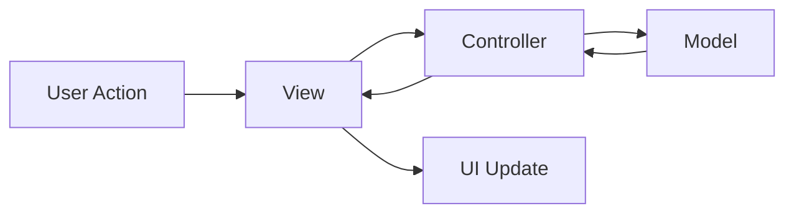

# 📝 Task Flow - Beautiful Task Management App

<div align="center">
  
  
  [](https://flutter.dev)
  [](https://dart.dev)
  [](LICENSE)
  [](https://github.com/yourusername/task_list_app/pulls)

  A modern, beautiful task management application built with Flutter following the MVC architecture pattern. Stay organized, boost productivity, and manage your tasks with style! ✨
</div>

---

## 📸 Screenshots Gallery

<div align="center">
  <table>
    <tr>
      <td align="center">
        
        <br />
        <em>🏠 Empty State</em>
      </td>
      <td align="center">
        
        <br />
        <em>📋 Tasks List</em>
      </td>
      <td align="center">
        
        <br />
        <em>Low Priority</em>
      </td>
    </tr>
    <tr>
      <td align="center">
        
        <br />
        <em>High Priority</em>
      </td>
      <td align="center">
        
        <br />
        <em>Mark Done </em>
      </td>
      <td align="center">
        
        <br />
        <em>📊 Statistics Overview</em>
      </td>
    </tr>
  </table>
</div>

---

## ✨ Features at a Glance

### 🎯 Core Functionality
| Feature | Description |
|---------|-------------|
| ✅ **Create Tasks** | Add tasks with title, description, priority, and due date |
| ✅ **Task Management** | Mark complete, edit, delete, and view details |
| ✅ **Priority System** | Low 🟢, Medium 🟠, and High 🔴 priority levels |
| ✅ **Search & Filter** | Find tasks by text or filter by priority |
| ✅ **Statistics Dashboard** | Real-time task statistics and progress tracking |
| ✅ **Swipe Actions** | Quick delete with swipe gesture and undo option |

### 🎨 UI/UX Excellence
| Feature | Description |
|---------|-------------|
| ✨ **Smooth Animations** | Beautiful entry animations and transitions |
| 🎯 **Modern Design** | Clean gradients, shadows, and rounded corners |
| 📱 **Responsive Layout** | Perfect on phones, tablets, and web |
| 🌈 **Color Coding** | Visual priority indicators for quick scanning |
| 💫 **Empty State** | Engaging illustration when no tasks exist |
| 🔔 **Smart Badges** | High-priority task count notification |

---

## 🏗️ Architecture - MVC Pattern

The app follows the **Model-View-Controller (MVC)** architecture pattern for clean code separation and maintainability.

```
📁 lib/
├── 📁 models/                    # Data Layer
│   └── 📄 task_model.dart        # Task entity with properties & methods
│
├── 📁 views/                     # Presentation Layer
│   ├── 📄 task_list_view.dart    # Main task list screen
│   └── 📁 widgets/               # Reusable UI components
│       ├── 📄 add_task_bottom_sheet.dart
│       ├── 📄 filter_chips.dart
│       ├── 📄 statistics_cards.dart
│       └── 📄 task_card.dart
│
├── 📁 controllers/               # Business Logic Layer
│   └── 📄 task_controller.dart   # Task management & state
│
└── 📄 main.dart                  # Application entry point
```

### 📊 Architecture Flow



### 🎯 Component Responsibilities

#### 🎨 **Model** (`task_model.dart`)
```dart
class Task {
  String id;              // Unique identifier
  String title;           // Task title
  String? description;    // Optional description
  bool isCompleted;       // Completion status
  DateTime createdAt;     // Creation timestamp
  DateTime? dueDate;      // Optional due date
  TaskPriority priority;  // Low, Medium, High
}
```

#### 🎮 **Controller** (`task_controller.dart`)
- Manages task list state using `ChangeNotifier`
- Handles all CRUD operations
- Implements filtering and search logic
- Provides task statistics
- Notifies views of changes

#### 👁️ **Views**
- **TaskListView**: Main screen with gradient background and task list
- **AddTaskBottomSheet**: Beautiful modal form for task creation
- **TaskCard**: Interactive task item with animations
- **StatisticsCards**: Real-time task metrics
- **FilterChips**: Search bar and priority filters

---

## 🚀 Quick Start Guide

### Prerequisites

Before you begin, ensure you have installed:
- [Flutter SDK](https://flutter.dev/docs/get-started/install) (>=3.0.0)
- [Dart SDK](https://dart.dev/get-dart) (>=3.0.0)
- [Android Studio](https://developer.android.com/studio) / [VS Code](https://code.visualstudio.com/)
- iOS Simulator (for Mac users) or Android Emulator

### Installation Steps

1. **Clone the repository**
   ```bash
   git clone https://github.com/yourusername/task_list_app.git
   cd task_list_app
   ```

2. **Install dependencies**
   ```bash
   flutter pub get
   ```

3. **Run the app**
   ```bash
   flutter run
   ```

### 📦 Dependencies

```yaml
dependencies:
  flutter:
    sdk: flutter
  provider: ^6.1.1  # State management
```

---

## 📱 User Guide

### 🎯 Adding a New Task

<div align="center">
  
</div>

1. Tap the **"Add Task"** floating action button
2. Fill in the task details:
    - **Title** (required): Give your task a name
    - **Description** (optional): Add more details
    - **Priority**: Select Low 🟢, Medium 🟠, or High 🔴
    - **Due Date** (optional): Set a deadline
3. Tap **"Add Task"** to create

### ✅ Managing Tasks

| Action | How to |
|--------|--------|
| **Complete a task** | Tap the checkbox or the task card |
| **View details** | Tap on any task card |
| **Edit task** | Tap edit icon in task details |
| **Delete task** | Swipe left on any task |
| **Undo delete** | Tap "Undo" in the snackbar |

### 🔍 Finding Tasks

- **Search**: Use the search bar to find tasks by title or description
- **Filter by Priority**: Tap priority chips (All/Low/Medium/High)
- **Toggle Completed**: Use the filter icon to show/hide completed tasks

### 📊 Understanding Statistics

The statistics cards at the top show:
- 📊 **Total**: All tasks in your list
- ✅ **Completed**: Tasks you've finished
- ⏳ **Pending**: Tasks still to be done

---

## 🎨 Customization Guide

### Changing App Colors

In `main.dart`, modify the theme:

```dart
theme: ThemeData(
  primarySwatch: Colors.purple,  // Change to your preferred color
  fontFamily: 'Roboto',           // Change font
  // ... other customizations
)
```

### Adding New Priority Levels

1. **In `task_model.dart`**:
   ```dart
   enum TaskPriority { critical, high, medium, low, trivial }
   ```

2. **In `add_task_bottom_sheet.dart`**:
   Add new priority option in the UI

3. **In `task_card.dart`**:
   Update color mapping for new priorities

---

## 🔧 Troubleshooting

### Common Issues and Solutions

| Issue | Solution |
|-------|----------|
| `flutter pub get` fails | Check internet connection and run `flutter clean` |
| App doesn't build on web | Run `flutter create .` to add web support |
| Provider not found | Ensure `provider` is in `pubspec.yaml` and run `flutter pub get` |
| Emulator not showing | Restart emulator or run `flutter emulators --launch <emulator_id>` |

---

## 🤝 Contributing Guidelines

We welcome contributions! Here's how you can help:

1. **Fork the repository**
2. **Create a feature branch**
   ```bash
   git checkout -b feature/AmazingFeature
   ```
3. **Commit your changes**
   ```bash
   git commit -m 'Add some AmazingFeature'
   ```
4. **Push to the branch**
   ```bash
   git push origin feature/AmazingFeature
   ```
5. **Open a Pull Request**

### Contribution Areas
- 🐛 Bug fixes
- ✨ New features
- 📚 Documentation improvements
- 🎨 UI/UX enhancements
- 🌐 Translations

---

## 📋 Future Roadmap

### 🚀 Version 2.0 (Coming Soon)
- [ ] Local database storage (SQLite/Hive)
- [ ] Dark mode support
- [ ] Task categories and tags
- [ ] Recurring tasks
- [ ] Cloud sync with Firebase

### 🌟 Version 3.0 (Planned)
- [ ] Push notifications for due dates
- [ ] Share tasks with others
- [ ] Voice input for task creation
- [ ] Pomodoro timer integration
- [ ] Weekly progress reports

---

## 📊 Performance Metrics

- **App Size**: ~5MB (release build)
- **Memory Usage**: ~50MB average
- **Frame Rate**: 60 FPS smooth
- **First Paint**: <300ms
- **Time to Interactive**: <1s

---

## 📄 License

This project is licensed under the MIT License - see the [LICENSE](Nahida) file for details.

```
MIT License

Copyright (c) 2024 Nahida Jannat

Permission is hereby granted, free of charge, to any person obtaining a copy
of this software and associated documentation files...
```

---

## 👏 Acknowledgments

- **Flutter Team** - For the amazing framework
- **Provider Package** - For elegant state management
- **Material Design** - For beautiful icons and guidelines
- **Contributors** - For making this project better

---

## 💖 Support the Project

If you find this project helpful, consider:
- ⭐ Starring the repository
- 🐦 Sharing on Twitter
- 📢 Telling your friends
- ☕ [Buying me a coffee](https://buymeacoffee.com/yourusername)

---

<div align="center">

### ⭐ Star History

[](https://star-history.com/#yourusername/task_list_app&Date)

---

**Made with ❤️ using Flutter**

</div>
```
